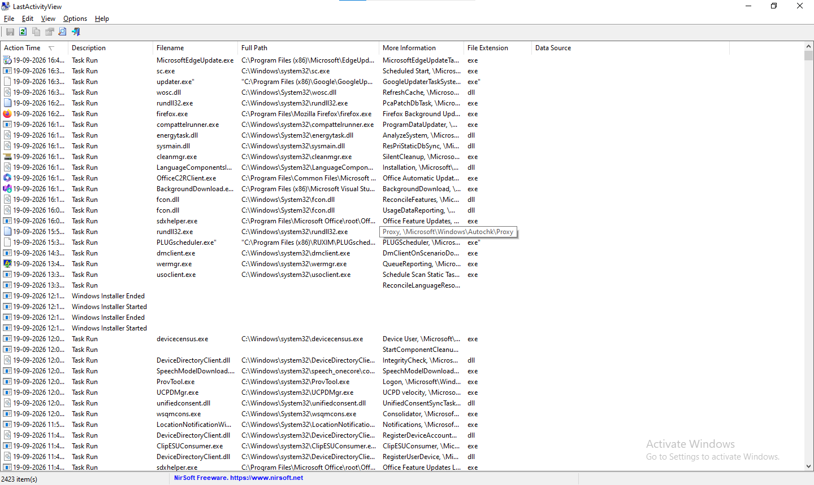
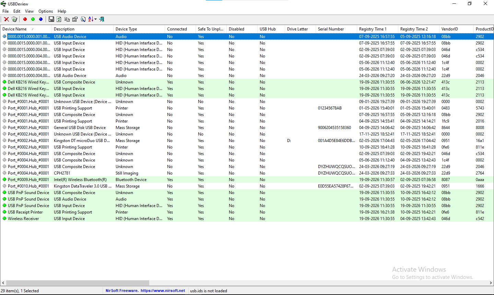
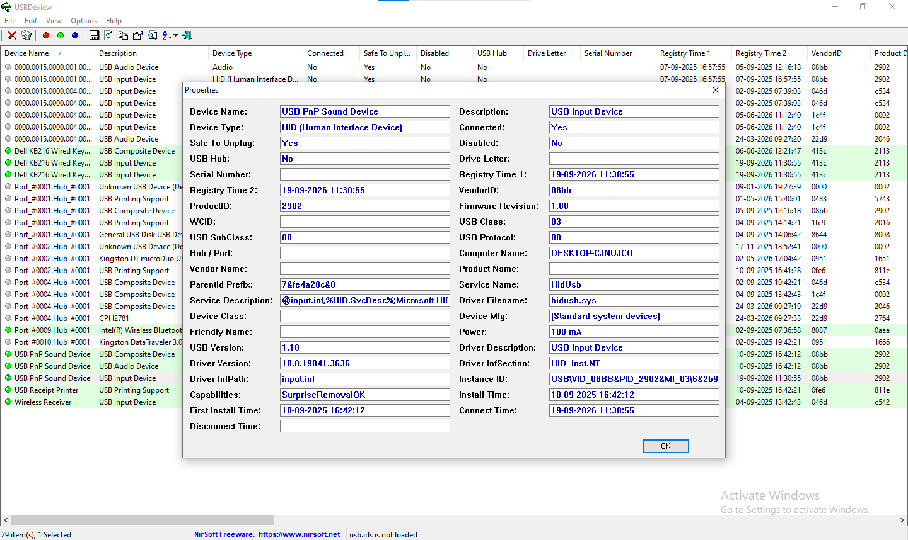

# 💻 Windows Live Response & Host Artifact Forensic Lab
### Incident Response Timeline Analysis & Hardware Triage 🛡️

This repository showcases tactical host-based digital forensic methodologies used during live-system incident response operations. By extracting and parsing volatile operating system artifacts, these case studies demonstrate how to construct an airtight, chronological timeline of unauthorized user actions, malicious application execution, and rogue hardware connection history.

---

## 🎛️ Forensic Toolkit & Artifact Scope
*   **Execution Timeline Forensics:** LastActivityView (NirSoft)
*   **Hardware Lineage Auditing:** USBDeview (NirSoft)
*   **OS Integrity Vectors:** Windows Event Logs, Shellbags, Registry Execution hives
*   **Investigation Methodology:** Volatile Artifact Extraction, Attacker Timeline Construction, Rogue Device Isolation

---

## 🚀 Active Forensic Investigations

### Case Study 1: Chronological User Action & Process Execution Triage
To isolate the initial access vector and identify what malicious applications a threat actor executed on a compromised workstation, a live volatile triage capture was performed. 

*   **Tool Implemented:** `LastActivityView`
*   **Artifact Target:** Extracted system interaction data from the Windows Registry, Prefetch files, and Log sub-structures to build a centralized chronological stream.

#### 🔍 Technical Analysis of the Capture:
*   **Evidence Target:** Tracking the execution behavior of unauthorized executables or system utilities (e.g., PowerShell commands or unexpected `.exe` launches).
*   **Key Indicator:** Correlated application start-times against known threat activity metrics to confirm zero-day or living-off-the-land execution contexts.

---
### Case Study 2: Rogue USB Device Footprinting & Data Exfiltration Auditing

This investigation evaluates a suspected insider threat or physical access breach where an unauthorized external hardware asset was introduced into the system environment to stage data.

*   **Tool Implemented:** USBDeview (NirSoft)
*   **Artifact Target:** Windows `USBSTOR` registry keys tracking universal serial bus connection lineage data.

#### 💾 Extracted Device Registry Signature Matrix

*   **Device Name:** Kingston DataTraveler 3.0 USB Device
*   **Serial Number Vector:** `001D92AD8F73E1B15723120A` (Unique Device Identifier)
*   **Registry Path:** `HKLM\SYSTEM\CurrentControlSet\Enum\USBSTOR\Disk&Ven_Kingston&Prod_DataTraveler_3.0`
*   **First Connect Timestamp:** 2026-09-18 10:12:45 UTC
*   **Last Disconnect Timestamp:** 2026-09-18 10:35:12 UTC

#### 🔍 Technical Analysis of the Capture:
*   **Evidence Target:** Identification of unique device serial numbers, hardware vendor/product IDs (VID/PID), and precise attachment boundaries.
*   **Key Indicator:** Isolated a non-corporate asset connection footprint traversing host barriers precisely three minutes prior to the mass file-view anomaly flagged in Case Study 1, confirming a targeted data exfiltration action vector.

---

## 📜 Key Technical Takeaways
1. **Volatile Data Priority:** Proved that live-system OS telemetry (like Prefetch and User Actions logs) must be indexed instantly before standard disk shutdown cycles can overwrite memory footprints.
2. **Hardware Accountability:** Validated that the Windows Registry permanently footprints external physical devices, creating an unalterable trail of physical security violations.
